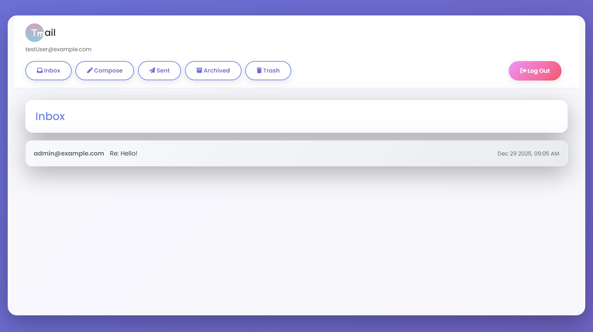

# Tmail - Full Stack Email Web Application

[](https://python.org)
[](https://djangoproject.com)
[](https://developer.mozilla.org/en-US/docs/Web/JavaScript)
[](https://getbootstrap.com)
[](https://sqlite.org)
[](https://sass-lang.com)

[](dashboard.png)

## 📋 Table of Contents

- [Tmail - Full Stack Email Web Application](#tmail---full-stack-email-web-application)
  - [📋 Table of Contents](#-table-of-contents)
  - [📖 About The Project](#-about-the-project)
    - [Key Advantages](#key-advantages)
  - [✨ Features](#-features)
  - [🛠 Tech Stack](#-tech-stack)
    - [Backend](#backend)
    - [Frontend](#frontend)
    - [Development Tools](#development-tools)
  - [🚀 Getting Started](#-getting-started)
    - [Prerequisites](#prerequisites)
    - [Installation](#installation)
      - [Method 1: Using UV (Recommended)](#method-1-using-uv-recommended)
      - [Method 2: Using pip](#method-2-using-pip)
      - [Method 3: Using Docker](#method-3-using-docker)
      - [Tmail provides complete Docker support for easy deployment](#tmail-provides-complete-docker-support-for-easy-deployment)
      - [Using Docker Compose (Recommended)](#using-docker-compose-recommended)
      - [Compile SCSS to CSS](#compile-scss-to-css)
    - [Running the Application](#running-the-application)
  - [📱 Usage](#-usage)
  - [📁 Project Structure](#-project-structure)
  - [Contributing](#contributing)
  - [Quick Start for Contributors](#quick-start-for-contributors)
  - [License](#license)
  - [Contact](#contact)

## 📖 About The Project

Tmail is a full-stack email web application that allows users to use mail services with their custom email addresses. Unlike traditional email services that rely on mail servers, Tmail uses Django as an API backend with a database to store all emails, making it domain-independent and much faster.

The application provides all standard email functionalities including:

- **Compose** - Create and send new emails
- **Inbox** - View received emails
- **Sent** - View sent emails
- **Archive** - Archive important emails
- **Trash** - Manage deleted emails

Tmail operates similarly to a real-time chat application but with an email interface and user registration functionality.

### Key Advantages

- 🚀 **No Mail Server Dependency** - Uses Django API backend instead of traditional mail servers
- ⚡ **High Performance** - Database-driven architecture for faster operations
- 🔐 **Custom Domains** - Use your own custom email addresses
- 💾 **SQLite Database** - Lightweight and efficient data storage
- 🎨 **Modern UI** - Clean interface with SCSS and Bootstrap

## ✨ Features

- **User Registration & Authentication** - Secure user accounts with registration/login
- **Real-time Email Management** - Instant email sending and receiving
- **Email Organization** - Categorize emails into Inbox, Sent, Archive, and Trash
- **Responsive Design** - Works on desktop and mobile devices
- **Custom Email Addresses** - Use personalized email addresses

## 🛠 Tech Stack

### Backend

- **Django** - High-level Python web framework
- **SQLite** - Lightweight database for data storage

### Frontend

- **HTML5** - Markup language for structure
- **SCSS/CSS** - Advanced styling with variables and nesting
- **JavaScript (ES6+)** - Dynamic functionality and DOM manipulation
- **Bootstrap 5** - Responsive CSS framework
- **Jinja2** - Templating engine for Django

### Development Tools

- **npm** - Package manager for SCSS compilation
- **Docker** - Containerization (optional)
- **Git** - Version control

## 🚀 Getting Started

### Prerequisites

- Python 3.8 or higher
- Node.js and npm (for SCSS compilation)
- Git

### Installation

#### Clone repo
```bash
git clone https://github.com/pyaiShark/Full-Stack-Email-Application
cd Full-Stack-Email-Application
```

#### Method 1: Using UV (Recommended)

```bash
# Create virtual environment
uv venv

# Activate virtual environment
source .venv/bin/activate  # On Windows: .venv\Scripts\activate

# Install dependencies (Check the file then run the cmd)
cd mail/
uv pip install -r requirements.txt
```

#### Method 2: Using pip

```bash
# Create virtual environment
python3 -m venv .venv

# Activate virtual environment
source .venv/bin/activate  # On Windows: .venv\Scripts\activate

# Install dependencies (Check the file then run the cmd)
cd mail/
pip install -r requirements.txt
```

#### Method 3: Using Docker

#### Tmail provides complete Docker support for easy deployment

#### Using Docker Compose (Recommended)

1. **Build and run with Docker Compose**

   ```sh
   # Build and start all services
   docker-compose up --build
   
   # Run in detached mode
   docker-compose up -d
   
   # View logs
   docker-compose logs -f
   ```

2. **Run database migrations in Docker**

   ```sh
   # Apply migration
   # No need to do this manually, Its already done by us
   docker-compose exec web python manage.py migrate
   
   # Create superuser
   docker-compose exec web python manage.py createsuperuser
   ```

3. **Docker Compose commands**

   ```sh
   # Stop services
   docker-compose down
   
   # Stop and remove volumes
   docker-compose down -v
   
   # Rebuild specific service
   docker-compose up --build t-mail
   
   # View running containers
   docker-compose ps
   ```

#### Compile SCSS to CSS

```bash
# Install SCSS compiler
npm install sass

# Install SCSS compiler (you can also do that using apt)
sudo apt install sass

# Compile SCSS to CSS
sass static/mail/style.scss:static/mail/style.css

# Or watch for changes (Use when you change while running the app)
sass --watch static/mail/style.scss:static/mail/style.css
```

### Running the Application

1. **Apply database migrations:**

```bash
# Its already done
python manage.py makemigrations mail

# Only run this
python manage.py migrate
```

1. **Create a superuser (optional for admin access):**

```bash
python manage.py createsuperuser
```

1. **Run the development server:**

```bash
python manage.py runserver
```

1. **Access the application:**

- Open your browser and navigate to `http://localhost:8000`
- Admin panel: `http://localhost:8000/admin` (if superuser created)

## 📱 Usage

1. **Registration & Login**
   - Create a new account with your preferred email address
   - Log in to access your personalized email dashboard

2. **Composing Emails**
   - Click "Compose" to create a new email
   - Enter recipient, subject, and message
   - Send instantly to the recipient's inbox

3. **Managing Emails**
   - **Inbox**: View all received emails
   - **Sent**: Review emails you've sent
   - **Archive**: Store important emails for later reference
   - **Trash**: Manage deleted emails with restore option

4. **Real-time Updates**
   - New emails appear instantly without page refresh
   - Sent emails are immediately available in the Sent folder

## 📁 Project Structure

``` python
tmail/
├── mail/                   # Main Django app
│   ├── models.py           # Database models
│   ├── views.py            # View logic
│   ├── urls.py             # URL routing
│   └── templates/          # HTML templates
├── static/
│   ├── css/                # Compiled CSS
│   ├── scss/               # SCSS source files
│   └── js/                 # JavaScript files
├── requirements.txt        # Python dependencies
├── manage.py              # Django management script
└── README.md              # This file
```

## Contributing

Contributions are what make the open source community such an amazing place to learn, inspire, and create. Any contributions you make are greatly appreciated.

For detailed contribution guidelines, please see [CONTRIBUTING.md](CONTRIBUTOR.md)

## Quick Start for Contributors

1. **Fork the Project**

2. **Create your Feature Branch**  
   `git checkout -b feature/AmazingFeature`

3. **Commit your Changes**  
   `git commit -m 'Add some AmazingFeature'`

4. **Push to the Branch**  
   `git push origin feature/AmazingFeature`

5. **Open a Pull Request**

<p align="right">(<a href="#readme-top">back to top</a>)</p>

## License

Distributed under the MIT License. See [LICENSE](LICENSE) for more information.

<p align="right">(<a href="#readme-top">back to top</a>)</p>

## Contact

Goutam Mandal - [Linkedin](https://www.linkedin.com/in/goutam-mandal-g000m)

<p align="right">(<a href="#readme-top">back to top</a>)</p>
